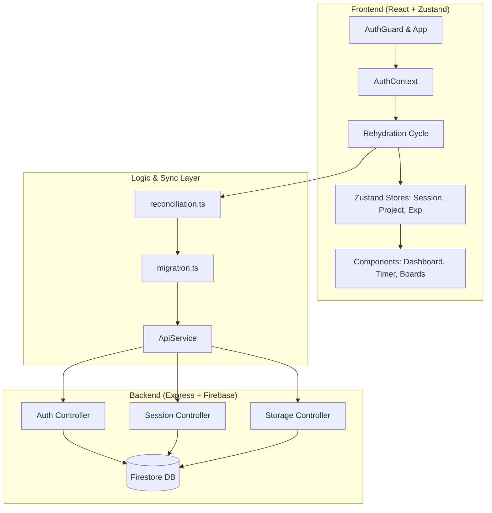
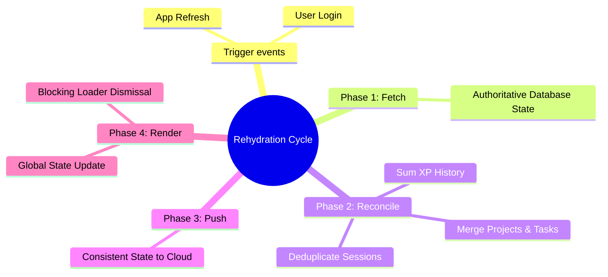

# FocusFlow: Deep Work & Productivity System

**Project Name:** FocusFlow  
**Date:** January 29, 2026  
**Group:** Group 48

FocusFlow is a high-performance productivity application designed for "Time Lords" and "Zen Archers." It combines focus timers, task management, and gamified XP progression with a robust, authoritative synchronization engine.

## 1. Problem Statement
In the modern digital workspace, students face two major challenges: information overload and motivation fatigue. While traditional to-do list applications help users record tasks, they often fail to encourage consistent execution. Users commonly experience burnout due to poor break structure or abandon productivity tools because they feel tedious and unrewarding. Complex enterprise tools are excessive for personal productivity, while simple checklist apps lack support for deep, focused work. There is a clear need for a unified productivity platform that not only organizes tasks but actively motivates users through structured focus techniques.

## 2. Target Audience
**Primary:** University students and academic researchers managing multiple assignments and deadlines.  
**Psychographics:** Users who struggle with procrastination and respond positively to visual progress indicators, rewards, and game-like motivation systems.

## 3. Core Features
The application is built around three core functional pillars:

- **Visual Workflow Management**: 
    - A task management system using “To Do,” “In Progress,” and “Done” columns. 
    - Users can create, edit, delete, and move tasks. 
    - Priority-based XP rewards (Low, Medium, High, Critical).
    - Data persisted using authoritative cloud synchronization.

- **Integrated Focus Timer (Pomodoro Technique)**: 
    - A customizable focus timer (e.g., 25-minute work sessions with 5-minute breaks).
    - Activates a distraction-reduced “Focus Mode.”
    - Tracks completed sessions with real-time cloud sync every 10 seconds.

- **Gamification & Analytics Engine**: 
    - A reward system that grants Experience Points (XP) for completed tasks and focus sessions. 
    - Recalculates levels (e.g., Novice Focuser to Ultimate Productivity Sage).
    - A dashboard displays productivity metrics such as total focus hours and weekly progress to reinforce motivation.

- **Resilient Guest-to-Auth Migration**: Smooth transition for offline users, merging local gains with cloud history upon login.
- **Universal Rehydration**: Global application state that ensures data integrity across all devices through a robust reconciliation cycle.

## 🏗 System Architecture

## 🔄 The Rehydration Cycle (Authoritative Sync)

FocusFlow uses a unique "Capture and Reconcile" strategy to ensure you never lose progress.

## 🧠 Data Reconciliation Logic

When conflicts occur between your local device and the cloud, FocusFlow applies intelligent merging rules:

| Entity | Conflict Resolution Strategy |
| :--- | :--- |
| **Tasks** | Prioritizes "Done" status; merges sub-tasks by ID. |
| **XP** | Sums history entries by date; recalculates total levels. |
| **Sessions** | Prefers the version with the most elapsed time or "Completed" status. |
| **Settings** | Server-side settings are treated as authoritative. |

## 🛠 Tech Stack

- **Frontend**: Vite, React, TypeScript, Zustand (State Management), Tailwind CSS, Shadcn/UI, Lucide Icons.
- **Backend**: Node.js, Express, Firebase Admin (Firestore), JWT (Authentication).
- **Tooling**: Git (CLEAN .env handling), ESBuild, PostCSS.

## 4. Assigned Roles & Responsibilities

| Role | Team Member(s) | Key Responsibilities |
| :--- | :--- | :--- |
| **Project Manager** | Kelvin Jim-Wayne Kuttin | Team coordination, documentation, milestone tracking, Testing |
| **Front-End Developer** | Frank Fatawu, Benedict Pope Osei Okai, Samuel Nunya Amavih | React UI components, state management, responsive design |
| **Back-End / Logic Lead** | Aaron Kwadwo Boafo, Philip Nsiah Asare Amponsah, Kwabena Gyamfi Debrah | Local data persistence, timer logic, XP calculation |
| **UI/UX Designer** | Clinton Amponsah, Constance Naa Afoley Botchway, Jeffrey Agyei-Darteh | Wireframes, color palettes, gamified interface design |

## 👥 Group 48 Members

- Aaron Kwadwo BOAFO
- Jeffrey AGYEI-DARTEH
- Samuel Nunya AMAVIH
- Phillip Nsiah Asare AMPONSAH
- Clinton AMPONSAH
- Constance Naa Afoley BOTCHWAY
- Kwabena Gyamfi DEBRAH
- Benedict Pope Osei OKAI
- Kelvin Jim-Wayne KUTTIN

---

*This project is built for maximum productivity with zero data loss.*
