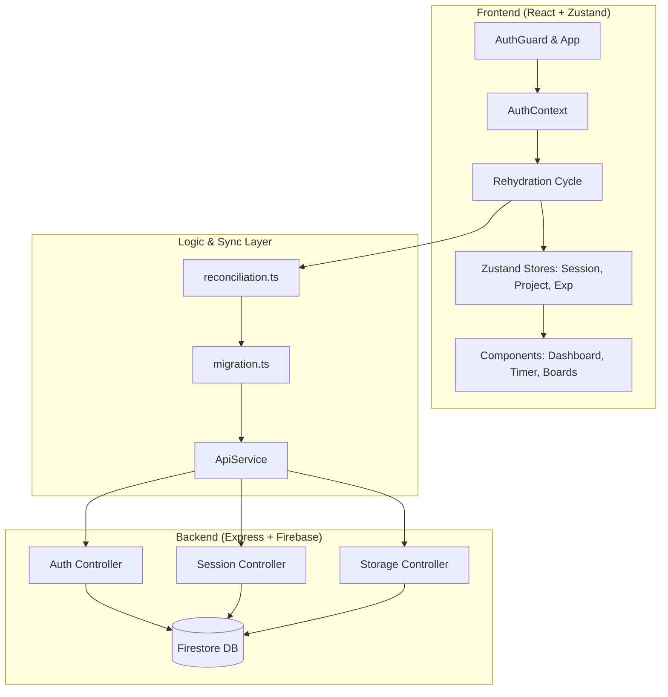
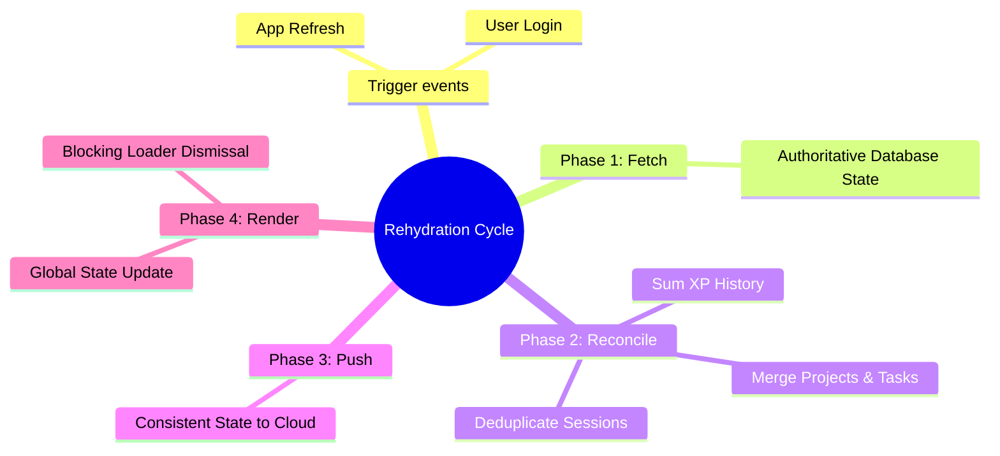

# FocusFlow: Deep Work & Productivity System

FocusFlow is a high-performance productivity application designed for "Time Lords" and "Zen Archers." It combines focus timers, task management, and gamified XP progression with a robust, authoritative synchronization engine.

## 🚀 Key Features

- **Authoritative Focus Timer**: Precise tracking of deep work sessions with real-time cloud synchronization every 10 seconds.
- **Smart Task Management**: Hierarchical task board with priority-based XP rewards (Low, Medium, High, Critical).
- **Gamified Progression**: Level up from a "Novice Focuser" to an "Ultimate Productivity Sage" by earning XP through focused sessions and task completion.
- **Resilient Guest-to-Auth Migration**: Smooth transition for offline users, merging local gains with cloud history upon login.
- **Universal Rehydration**: Global application state that ensures data integrity across all devices through a robust reconciliation cycle.

## 🏗 System Architecture

## 🔄 The Rehydration Cycle (Authoritative Sync)

FocusFlow uses a unique "Capture and Reconcile" strategy to ensure you never lose progress.

## 🧠 Data Reconciliation Logic

When conflicts occur between your local device and the cloud, FocusFlow applies intelligent merging rules:

| Entity | Conflict Resolution Strategy |
| :--- | :--- |
| **Tasks** | Prioritizes "Done" status; merges sub-tasks by ID. |
| **XP** | Sums history entries by date; recalculates total levels. |
| **Sessions** | Prefers the version with the most elapsed time or "Completed" status. |
| **Settings** | Server-side settings are treated as authoritative. |

## 🛠 Tech Stack

- **Frontend**: Vite, React, TypeScript, Zustand (State Management), Tailwind CSS, Shadcn/UI, Lucide Icons.
- **Backend**: Node.js, Express, Firebase Admin (Firestore), JWT (Authentication).
- **Tooling**: Git (CLEAN .env handling), ESBuild, PostCSS.

---

*This project is built for maximum productivity with zero data loss.*
